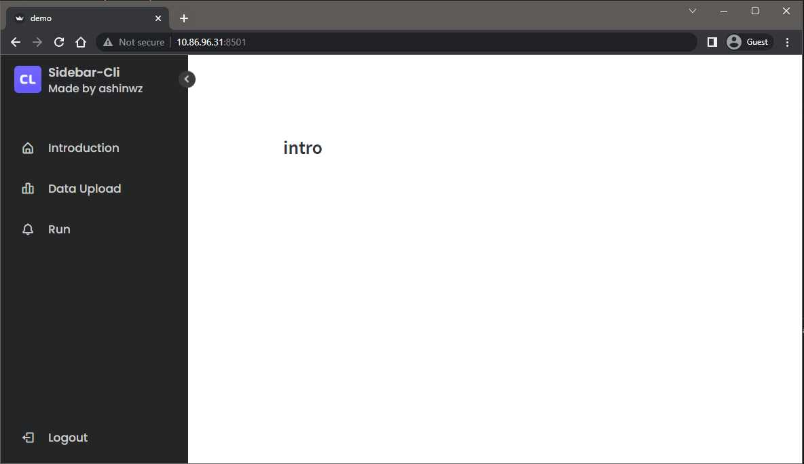
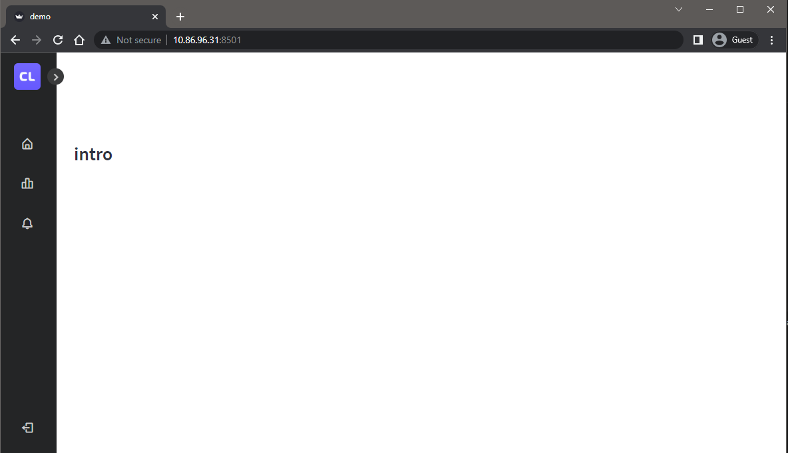

# Streamlit siderbar menu in Vue.js

Using Vue.js to build up the sidebar menu component and the menu bar supports switching multi-pages

## Setup

[Copy paste](https://github.com/ashinwz/streamlit-sidebar-menu.git) of the original demo.

- Ensure you have [Python 3.8+](https://www.python.org/downloads/), [Node.js](https://nodejs.org), and [npm](https://docs.npmjs.com/downloading-and-installing-node-js-and-npm) installed.
- Clone this repo.
- Create a new Python virtual environment for the template:

```
$ python3 -m venv venv  # create venv
$ . venv/bin/activate   # activate venv
$ pip install streamlit # install streamlit
```

- Initialize and run the component template frontend:

```
$ cd my_component/frontend
$ npm install    # Install npm dependencies
$ npm run serve  # Start the Webpack dev server
```

- From a separate terminal, run the template's Streamlit app:

```
$ . venv/bin/activate  # activate the venv you created earlier
$ streamlit run my_component/__init__.py  # run the example
```

- If all goes well, you should see something like this:
  
  


## Resources

- [Higher Order Components in Vue.js](https://medium.com/bethink-pl/higher-order-components-in-vue-js-a79951ac9176)
- [Do we need Higher Order Components in Vue.js?](https://medium.com/bethink-pl/do-we-need-higher-order-components-in-vue-js-87c0aa608f48)
- [Build better higher-order components with Vue 3](https://blog.logrocket.com/build-better-higher-order-components-with-vue-3/)
- [Scoped slots](https://v3.vuejs.org/guide/component-slots.html#scoped-slots)
- [Using Slots in Vue.js](https://www.smashingmagazine.com/2019/07/using-slots-vue-js/)
- [Single File Components](https://v3.vuejs.org/guide/single-file-component.html)
- [SFC Spec](https://vue-loader.vuejs.org/spec.html)
